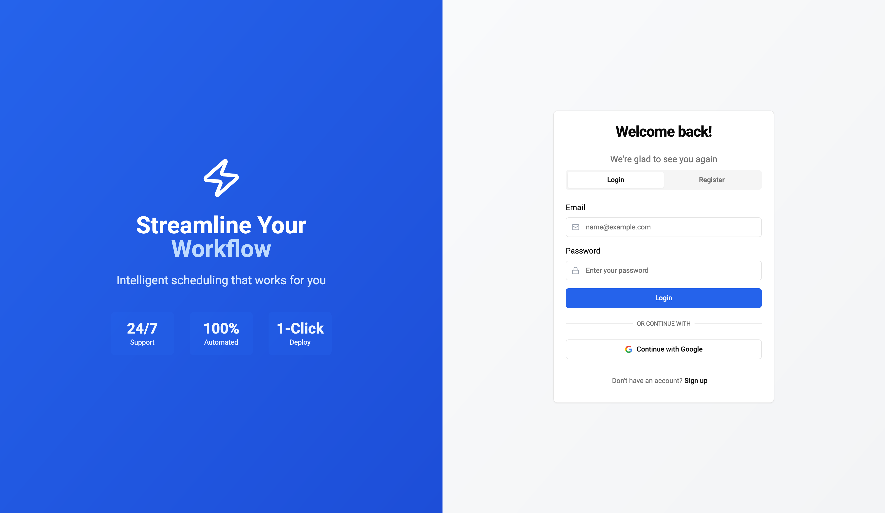
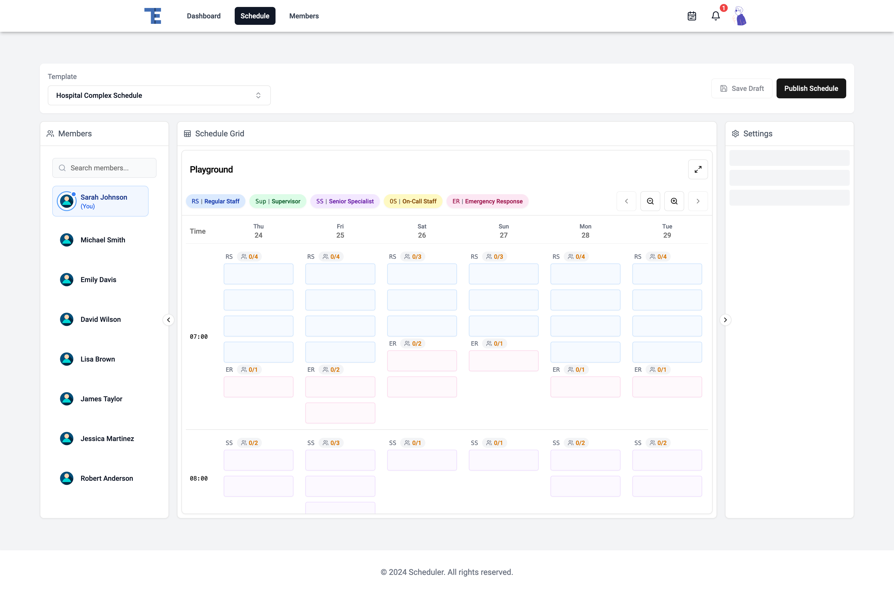
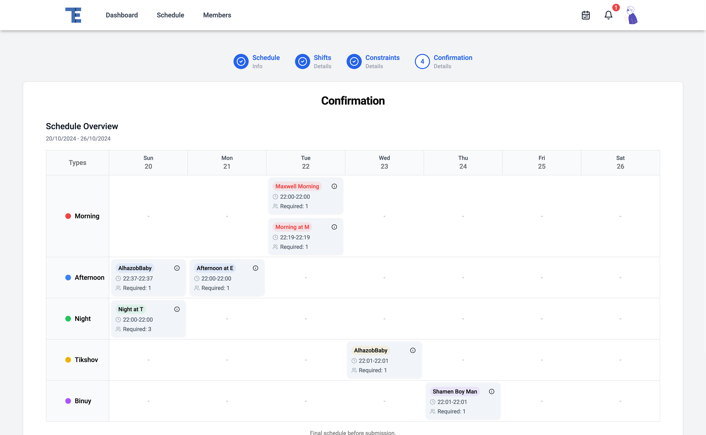

# Schedula

Intelligent shift scheduling system that combines automated scheduling with preference management. Built with TypeScript, Node.js, and React.

*Schedule Smarter, Work Better*


## 🖼️ Interface Preview

<p float="left">
  
   
  
</p>

## ✨ Key Features

- **Smart Scheduling**
  - Constraint-based optimization
  - Fair shift distribution
  - Conflict detection and resolution

- **Team Empowerment**
  - Preference submission system
  - Vacation management
  - Availability tracking
  - Schedule templates

- **Intuitive Interface**
  - Drag-and-drop scheduling
  - Real-time updates
  - Mobile-friendly design
  - Clear schedule visualization

## 🏗️ Tech Stack

- **Backend**
  - Node.js + TypeScript
  - PostgreSQL
  - Express.js
  
- **Frontend**
  - React + TypeScript
  - Tailwind CSS
  - shadcn/ui components

## 🚀 Quick Start

1. **Clone the repository**
```bash
git clone https://github.com/maxwellknight/schedula.git
cd schedula
```

2. **Start with Docker**
```bash
docker-compose up
```

3. **Or start services individually**
```bash
# Terminal 1 - Backend
cd backend
npm install
npm run dev

# Terminal 2 - Frontend
cd frontend
npm install
npm run dev
```

See individual README files in [backend](./backend/README.md) and [frontend](./frontend/README.md) directories for detailed setup instructions.

## 📁 Project Structure

```
.
├── backend/                 # Node.js + TypeScript backend
│   ├── src/
│   │   ├── algorithms/     # Scheduling logic
│   │   ├── controllers/    # Route handlers
│   │   ├── models/        # Database models
│   │   └── services/      # Business logic
│   └── docs/              # API documentation
├── frontend/               # React + TypeScript frontend
│   └── src/
│       ├── components/    # Reusable components
│       ├── pages/         # Page components
│       └── hooks/         # Custom hooks
└── docker-compose.yml     # Docker configuration
```

## 📋 Prerequisites

- Node.js 16+
- MySQL 9.0.1+
- Docker (optional)

## 📖 Documentation

- [Backend Documentation](./backend/README.md)
  - API endpoints
  - Database schema
  - Authentication system
  
- [Frontend Documentation](./frontend/README.md)
  - Component structure
  - State management
  - Routing system

## 🛠️ Development

### Environment Setup
1. Copy example environment files
```bash
cp backend/.env.example backend/.env
cp frontend/.env.example frontend/.env
```

2. Update environment variables as needed

### Database Setup
```bash
cd backend
# Run database setup
mysql -u <username> -p < dump/dump.sql
```

## 📝 Roadmap

- [ ] Add comprehensive test suite
- [ ] Implement real-time notifications
- [ ] Add schedule export options
- [ ] Enhance scheduling algorithm
- [ ] Add advanced reporting
- [ ] Mobile app development

## 📫 Contact

For questions or feedback, please open an issue or contact the maintainer.

## 📜 License

This project is private and proprietary. All rights reserved.
