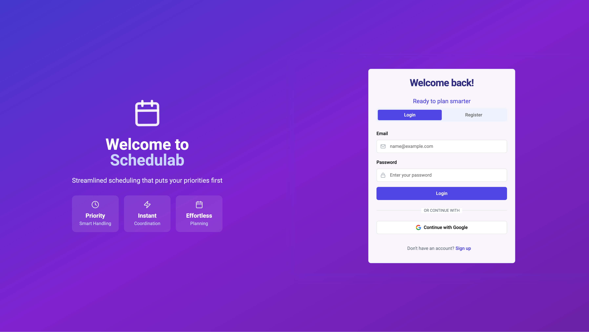

# Schedula

Intelligent shift scheduling system with automated scheduling and preference management.


## Preview

<div align="center">
  <p>
    
    <br>
    <em>Login Page with Google SSO Authentication</em>
  </p>
</div>

## Features

- **Smart Scheduling**: Constraint-based optimization with fair shift distribution
- **Team Management**: Preferences, vacations, and availability tracking
- **Modern Interface**: Drag-and-drop scheduling with real-time updates

## Tech Stack

- **Backend**: Node.js, TypeScript, MySQL 9.0.1
- **Frontend**: React, TypeScript, Tailwind CSS

## Quick Start

```bash
# Clone repository
git clone https://github.com/maxwellknight/schedulab.git
cd schedula

# Setup environment
cp .env.example .env

# Start services
docker-compose up
```

Detailed setup instructions in [backend](./backend/README.md) and [frontend](./frontend/README.md) directories.

## Project Structure

```
.
├── backend/            # Node.js backend
│   └── src/
│       ├── algorithms/ # Scheduling engine
│       ├── models/     # Database models
│       └── services/   # Business logic
└── frontend/          # React frontend
    └── src/
        ├── components/ # UI components
        └── pages/      # Page components
```

## Requirements

- Node.js 16+
- MySQL 9.0.1+
- Docker

## Documentation

- [Backend](./backend/README.md): API, database, auth
- [Frontend](./frontend/README.md): Components, state, routing

## License

Private and proprietary. All rights reserved.
